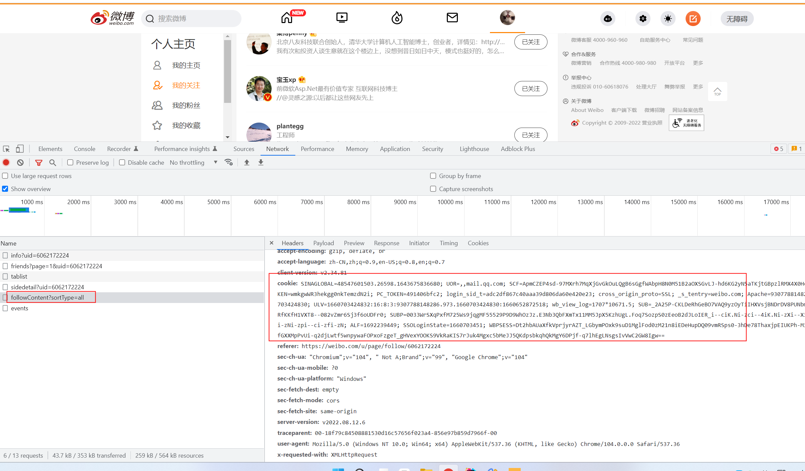
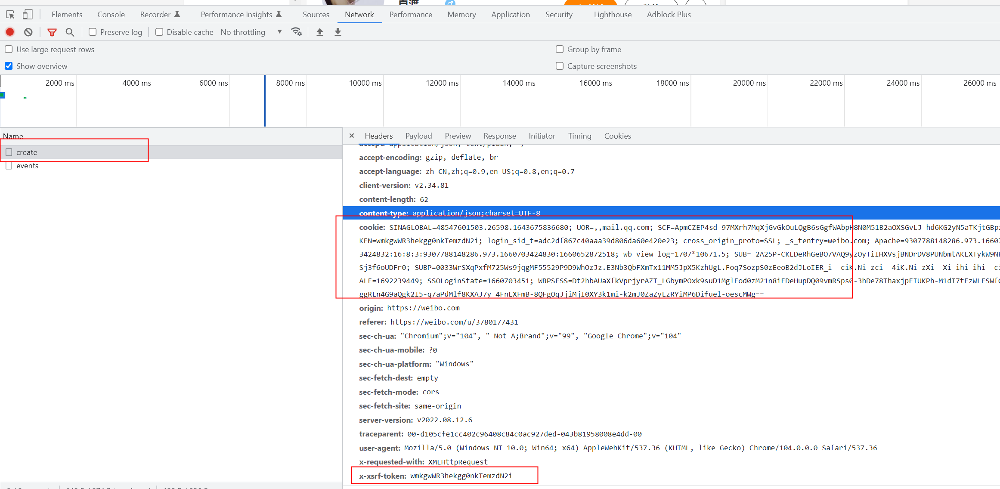

1. 登录旧账号 => 个人主页 => F12打开控制台NetWork => 我的关注 => 找到followContent接口 => 复制cookie粘贴到application.properties内的old-account-cookie

   

2. 登录新账号 => 随便找一个未关注的博主 => F12打开控制台NetWork => 关注 => 找到/friendships/create接口 => 复制cookie粘贴到application.properties内的new-account-cookie，复制x-xsrf-token粘贴到application.properties内的new-account-token

   

3. 执行Main#main

   关注太频繁会账号异常，导致短时间内无法新增关注，程序处理每间隔10s新增一个关注。